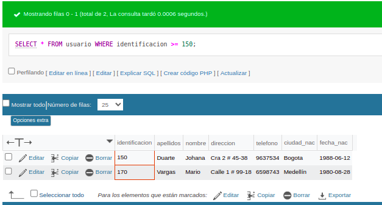
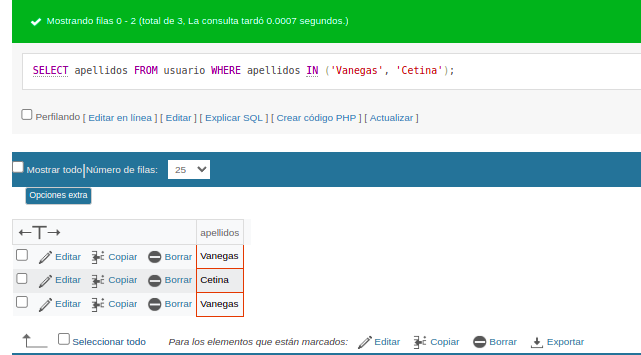
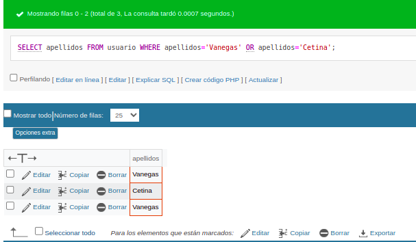
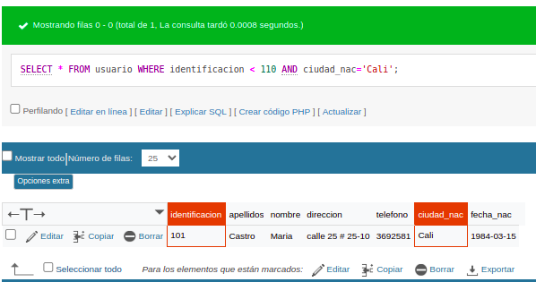
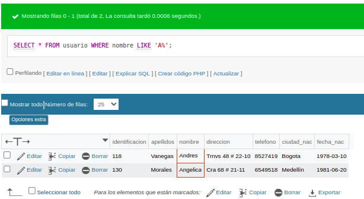
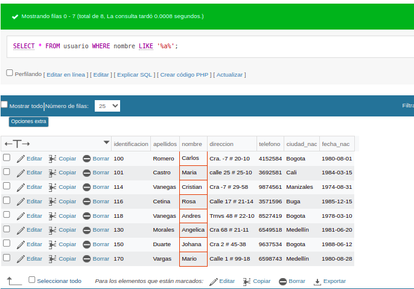
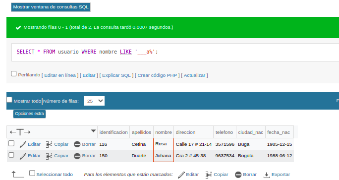
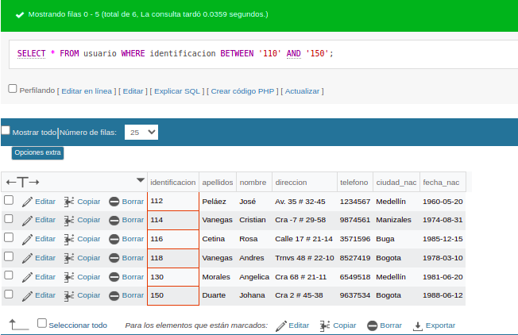
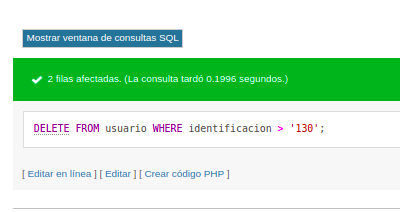

# Consulta #1 Sql

## CONSULTAS SQL

### 1. Para visualizar toda la información que contiene la tabla `usuario` se puede incluir con la instrucción SELECT el caracter `*` o cada una de los campos de la tabla 

- `SELECT * FROM usuario`

### 2. Seleccionar o visualizar solamente la identificación del usuario.

- `SELECT Identificación FROM usuario`

### 3. Si se desea obtener los registros cuya identificacion sean mayores o iguales a 150, se debe utilizar la consulta WHERE que especifica las condiciones que deben reunir los registros que se van a seleccionar-

- `SELECT * FROM usuario WHERE identificacion >= 150`

### 4. Si se desea obtener los registros cuyo sus apellidos sean Vanegas o Cetina, se debe utilizar el operador IN que especifica los registros 
- `SELECT apellidos FROM usuario WHERE apellidos IN ('Vanegas', 'Cetina')`

O se puede utilizar el operador OR.

- `SELECT apellidos FROM usuario WHERE apellidos='Vanegas' OR apellidos='Cetina'`

### 5. Si se desea obtener los registros cuya identificacion sea menor de '110' y la ciudad sea 'Cali', se debe utilizar el operador AND.

- `SELECT * FROM usuario WHERE identificacion < 110 AND ciudad_nac='Cali'`

### 6. Si se desea obtener los registros cuyos nombres empiecen por la letra 'A', se debe usar el operador LIKE que usa los patrones '%' (todos) y '_' (caracter).

- `SELECT * FROM usuario WHERE nombre LIKE 'A%'`

### 7. Si desea obtener los registros que contengan la letra 'a'.

`SELECT * FROM usuario WHERE nombre LIKE '%a%'`

### 8. Si se desea obtener los registros donde la cuarta letra del nombre sea una 'a'.

`SELECT * FROM usuario WHERE nombre LIKE '___a%'`

### 9. Si se desea obtener los registros cuya identificacion este entre el intervalo 110 y 150, se debe utilizar la clausula BETWEEN, que sirve para especificar un intervalo de valores.

`SELECT * FROM usuario WHERE identificacion BETWEEN '110' AND '150'`

## COMANDO DELETE

### 10. Para eleminar solamente los registro cuya identificacion sea mayor de 130.

`DELETE FROM usuario WHERE identificacion > '130'`

## COMANDO UPDATE

### 11. Para actualizar la ciudad de nacimiento de Andres Vanegas, cuya informacion es 118.

`UPDATE usuario SET ciudad_nac = 'Manizales' WHERE identificacion='118'`

